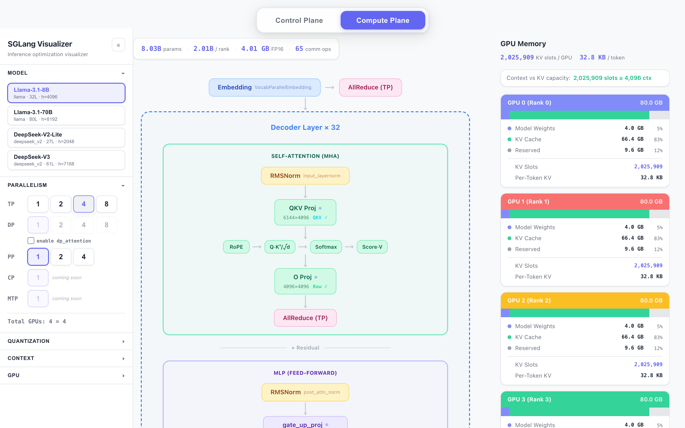
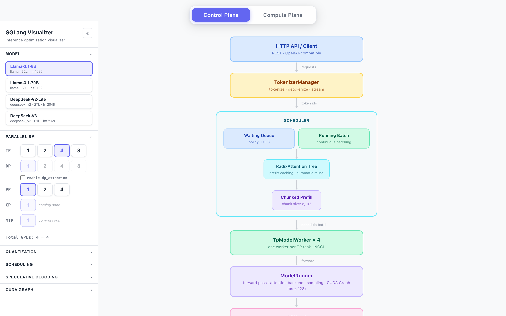

# SGLang Visualizer

SGLang 推理优化的交互式可视化工具。通过调节并行策略、量化方式、调度策略、投机解码、CUDA Graph 等参数，实时观察它们对模型架构、运行时拓扑和 GPU 显存的影响。

**在线体验:** https://pengchengneo.github.io/sglang-visual/

**Compute Plane** — 模型架构 + TP 切分 + GPU 显存分布：



**Control Plane** — SGLang 运行时架构全链路：



## 可视化的推理优化手段

| 优化类别 | 可交互参数 | 可视化效果 |
|---------|-----------|-----------|
| **并行策略** | TP、DP Attention、PP、EP | 权重矩阵切分方式、GPU 拓扑、通信算子、Worker 数量 |
| **量化** | 模型 dtype (FP16/BF16/FP32)、权重量化 (INT8/INT4/FP8)、KV Cache dtype (FP16/FP8) | 显存占用变化、KV Cache 容量翻倍 |
| **调度** | 调度策略 (FCFS/LPM/Random/DFS-Weight)、Chunked Prefill 大小、Radix Cache 开关 | 控制平面 Scheduler 内部结构标注 |
| **上下文长度** | 2K–128K 可选 | KV Cache 容量 vs 上下文长度对比告警 |
| **投机解码** | 算法 (EAGLE/EAGLE3/NextN/NGram)、Draft Token 数 | 控制平面新增 Speculative Decoding 层 |
| **CUDA Graph** | 开关、Max Batch Size | ModelRunner 标注 CUDA Graph 状态 |
| **GPU 配置** | 显存大小 (24–141 GB)、mem-fraction-static | 每块 GPU 的权重/KV/预留显存分布 |

## 两个视图

**Compute Plane** — 模型内部结构

- 左侧：模型架构图，展开可查看每个算子的权重形状、TP 切分策略、通信算子
- 右侧：GPU 显存面板，展示权重/KV Cache/预留显存占比，KV Slot 容量，上下文容量对比

**Control Plane** — SGLang 运行时架构

- 从 HTTP API 到 GPU 的完整数据流：HTTP → TokenizerManager → Scheduler → Worker → ModelRunner → GPU
- DP Attention 模式：多个 Scheduler 共享同一 Worker Pool，per-layer Attention 在 DP 子组内执行
- 动态标注调度策略、Chunked Prefill 大小、Radix Cache 状态、投机解码、CUDA Graph

## 项目结构

```
sglang-visual/
├── backend/                        # Python：模型结构分析 & JSON 生成
│   ├── pyproject.toml
│   ├── sglang_tp_viz/
│   │   ├── cli.py                  # CLI 入口 (sglang-tp-viz generate)
│   │   ├── config_loader.py        # 加载 HuggingFace / 本地模型配置
│   │   ├── schema.py               # Pydantic 数据模型
│   │   ├── tp_analyzer.py          # 模型结构分析核心逻辑
│   │   └── families/               # 模型家族模板
│   │       ├── base.py             # 基类
│   │       ├── llama.py            # Llama 系列 (Llama 3, Mistral 等)
│   │       └── deepseek_v2.py      # DeepSeek V2/V3 (MLA + MoE)
│   └── tests/
│       └── test_shapes.py          # 形状计算验证测试
│
├── frontend/                       # React 前端：交互式可视化
│   ├── package.json
│   ├── vite.config.ts
│   ├── tsconfig.json
│   ├── public/presets/             # 预生成的模型 JSON 数据
│   │   ├── manifest.json
│   │   ├── llama3_8b.json
│   │   ├── llama3_70b.json
│   │   ├── deepseek_v2_lite.json
│   │   └── deepseek_v3.json
│   └── src/
│       ├── App.tsx                 # 根组件：全部推理参数的状态管理
│       ├── App.css                 # 全局样式
│       ├── types/model.ts          # TypeScript 类型定义
│       ├── hooks/useModelData.ts   # 模型数据加载
│       ├── utils/
│       │   ├── gpuMemoryMath.ts    # GPU 显存 & KV Cache 计算
│       │   ├── tpMath.ts           # TP 形状重算 & 切分策略
│       │   ├── layoutMath.ts       # 布局计算
│       │   └── sankeyMath.ts       # Sankey 连线计算
│       └── components/
│           ├── sidebar/            # 侧边栏：推理优化参数配置
│           │   ├── Sidebar.tsx                # 侧边栏容器
│           │   ├── SidebarSection.tsx          # 手风琴组件
│           │   ├── ParallelismControls.tsx     # TP / DP Attention / PP / EP
│           │   ├── QuantizationControls.tsx    # dtype / 量化 / KV Cache dtype
│           │   ├── SchedulingControls.tsx      # 调度策略 / chunked prefill / radix cache
│           │   ├── ContextControls.tsx         # 上下文长度
│           │   ├── SpeculativeControls.tsx     # 投机解码
│           │   └── CudaGraphControls.tsx       # CUDA Graph
│           ├── controls/           # 顶部控制
│           │   ├── PlaneTabBar.tsx             # Compute / Control Plane 切换
│           │   ├── ModelSelector.tsx           # 模型选择器
│           │   ├── GpuControls.tsx             # GPU 显存 / mem-fraction-static
│           │   └── TpSizeSelector.tsx
│           ├── gpu/                # GPU 显存可视化
│           │   ├── GpuMemoryPanel.tsx          # 显存面板 (拓扑 + 卡片 + 容量对比)
│           │   └── GpuCard.tsx                 # 单 GPU 显存分布
│           ├── controlplane/       # 控制平面架构图
│           │   └── ControlPlaneView.tsx        # 运行时全链路可视化
│           ├── pipeline/           # 计算平面：模型结构
│           │   ├── PipelineView.tsx            # 统计栏 + 架构图
│           │   ├── PipelineStageBlock.tsx      # Embedding / LM Head
│           │   └── LayerGroupBlock.tsx         # Decoder 层组
│           ├── architecture/
│           │   └── ArchitectureDiagram.tsx     # 垂直架构图
│           ├── layer/              # 层内算子
│           │   ├── LayerBlockSvg.tsx
│           │   ├── OperatorRect.tsx
│           │   ├── SubBlockGroup.tsx
│           │   └── CommConnector.tsx
│           ├── matrix/             # 权重矩阵切分
│           │   ├── MatrixPartitionViz.tsx
│           │   └── GpuSliceView.tsx
│           └── connections/
│               └── SankeyConnector.tsx
│
├── generate_presets.py             # 批量生成预置模型 JSON
└── .github/workflows/deploy.yml   # GitHub Pages 自动部署
```

## 快速开始

### 启动前端

```bash
cd frontend
npm install
npm run dev
```

浏览器打开 http://localhost:5173/sglang-visual/

### 构建 & Lint

```bash
cd frontend
npm run build     # TypeScript 类型检查 + Vite 生产构建
npm run preview   # 预览生产构建
npm run lint      # ESLint 检查
```

## 后端 (可选)

后端从 HuggingFace 模型配置生成前端所需的 JSON 数据。前端自带预生成数据，不依赖后端即可运行。

### 安装

```bash
cd backend
pip install -e ".[dev]"
```

### 生成模型 JSON

```bash
# 从 HuggingFace Hub
sglang-tp-viz generate meta-llama/Llama-3.1-8B -o output.json

# 从本地 config.json
sglang-tp-viz generate /path/to/config.json -o output.json
```

### 重新生成所有预置模型

```bash
python generate_presets.py
```

### 后端测试

```bash
cd backend
pytest tests/ -v
```

覆盖 Llama 8B/70B 和 DeepSeek V2 Lite/V3 的权重形状、切分策略、通信模式验证。

## 技术栈

- **前端:** React 19 + TypeScript 5.9 + Vite 7
- **后端:** Python 3.10+ + Pydantic 2 + huggingface_hub
- **部署:** GitHub Pages (push main 自动部署)
- **状态管理:** React useState/useMemo，无外部状态库
